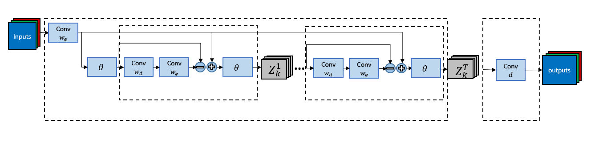
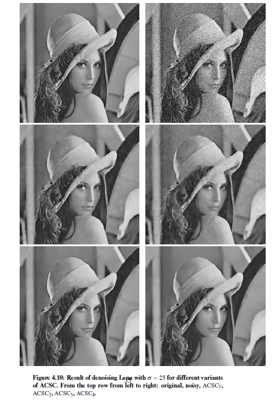

# Approximate Convolutional Sparse Coding (ACSC)

A pytorch implementation of a ACSC model based on **Lerned Convolutional Sparse Coding** model proposed [here](https://arxiv.org/abs/1711.00328) and or [here](https://ieeexplore.ieee.org/abstract/document/8462313).


## ACSC block description
 

## Evaluation of different ASCS variants
Image | Lena | House |  Pepper | Couple | Fgpr | Boat | Hill |  Man | Barbara
|---|---|---|---|---|---|---|---|---|---|
ACSC1 |31.28 |31.69 |29.88 |29.11| 26.43| 29.31| 29.35| 29.36| 27.85
ACSC2 |30.7| 30.83| 29.23| 28.61| 26.2| 28.95| 29.04| 28.98| 27.48
ACSC3| 32.15| 32.87| 30.67| 29.87| 27.18| 29.96| 29.833| 29.81| 29.41|
ACSC4| **32.268**| **33.25**| **30.7**| **30.03** |27.24| **30.04**| **29.93**| **29.87**| 29.71
BM3D| 31.97| 32.68| 29.63| 29.51| **27.73**| 29.7| 29.72| 29.42 |**30.64**



# Setup
For a linux with a cuda
simply run
```bash
pip instll pipenv && pipenv install --dev
```
This will install pipenv and pipenv will install the rest of the rest of dependencies specified in the Pipfile.
If Pipfile does not work then use Python version >= 3.6 and install using pip all dependencies (mostly just pytorch)

# Usage
Their are 3 main entry points:

 1. train_denoise.py
 2. test_denoise.py
 3. analyze_model.py

all entry points are run in the same fashion:
if PipFile  is used
```bash
pipenv run python xx.py --args_file params.json
```
or if pip is used
```bash
python3 xx.py --args_file params.json
```
Example for how to set *params.json* file can be found in *./saved_models/acsc[1-4]*.

## Train
train will build model and run train session using parameters that are givin in *params.json*.
*params.json* is updated and coped to log-path specified in *params.json*.
train will automatically run test and analyze.
```bash
pipenv run python train_denoise.py --args_file params.json
```
### Trainset

Download npz PASCAL VOC images provided [google drive](https://drive.google.com/open?id=1Ea5DN-LcuLd5ZGDEHeI_zqch5ewR6Sv4
)
make sure to specify dataset_path in *params.json*.

## Test
test will build the model specified in *params.json*.
Two types of tests are run:

1. PASCAL VOC2012 testset (must be downloaded)
2. famous images

all result are saved in log_dir provided in *params.json*.
```bash
pipenv run python test_denoise.py --args_file params.json
```

### Analyze
Evaluate model beyond test accuracy.
Sparsity factors etc.
```bash
pipenv run python analyze_denoise.py --args_file params.json
```

### Params file
Param file is first set with model + train + test parameter. During train and test the Params file is constantly updated. When A model is done training it saved its weights and the final state of the *params.json*. Thus running train on the saved *params.json* will load the last state of the saved model proceed to continue training session.
[Exmaple of initial params file]
```json
{
    "train_args":
    {
        "noise": 25,
        "epoch": 30,
        "batch_size": 15,
        "learning_rate": 1e-4,
        "dataset_path": "./pascal_120.npz",
        "log_dir": "saved_models/",
        "name": "acsc"
    },
    "model_args": {
        "num_input_channels": 1,
        "num_output_channels": 1,
        "kc": 64,
        "ks": 7,
        "ista_iters": 20,
        "iter_weight_share": true,
        "share_decoder": false
    },
    "test_args": {
        "noise": 25,
        "load_path": "",
        "name": "acsc",
        "testset_famous_path": "test_images/",
        "testset_pascal_path": "VOCdevkit/VOC2010/JPEGImages/"
    }
}
```
